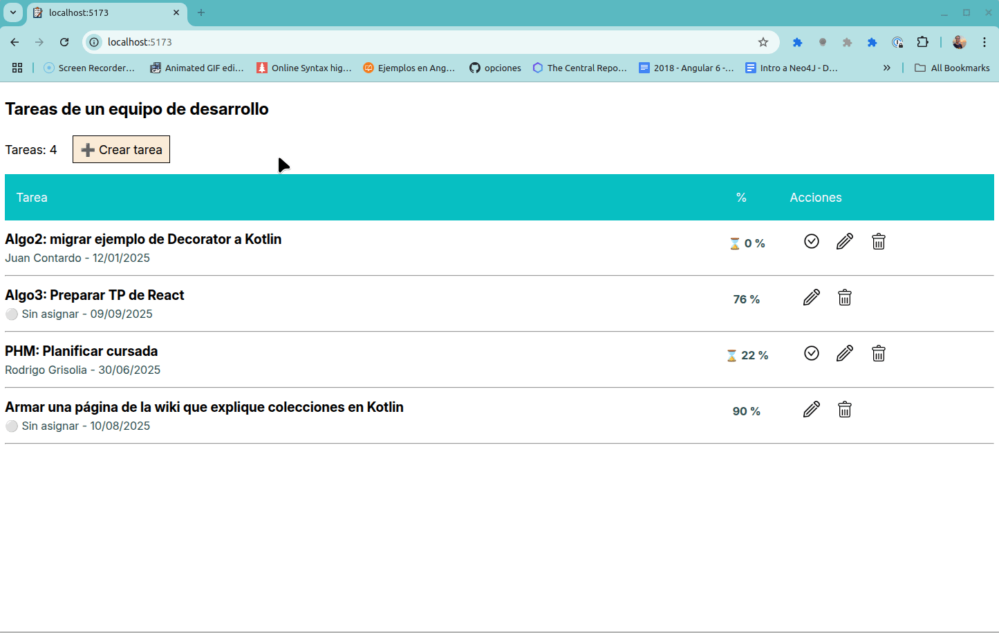
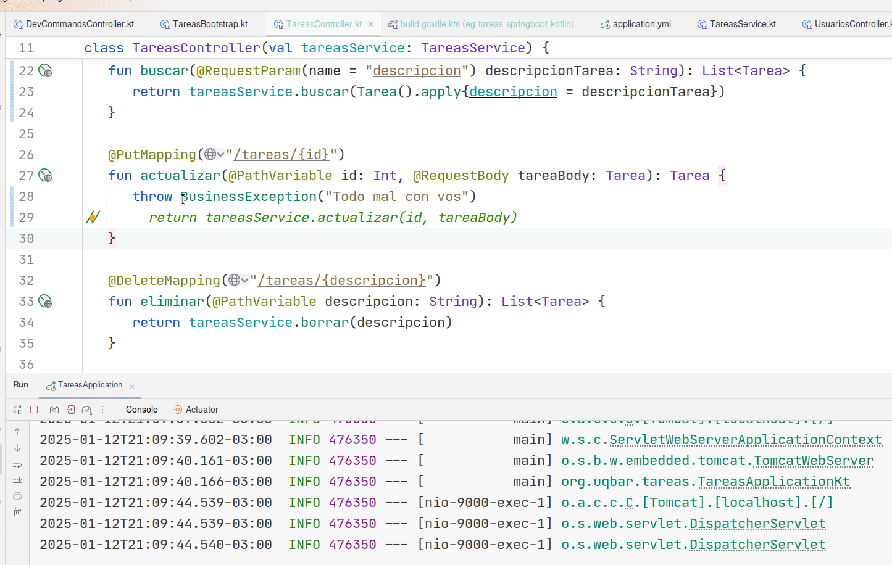

## Tareas de un equipo de desarrollo

 

Este ejemplo muestra

- la interacción con un backend, incluyendo el manejo de errores
- cómo se modela un formulario con validaciones
- la navegación de una página principal a una donde se toma información del backend

### Errores de negocio

### Errores de sistema

## TODO (Cosas que faltan)

- Agregar explicación README
- Agregar test e2e en local
- Que funcione test e2e en CI para lo cual hay que reapuntar a host.docker.internal en lugar de localhost (podemos reemplazar como hacía angular porque el manejo de variables de entorno en Svelte te fuerza a que uses server side)
